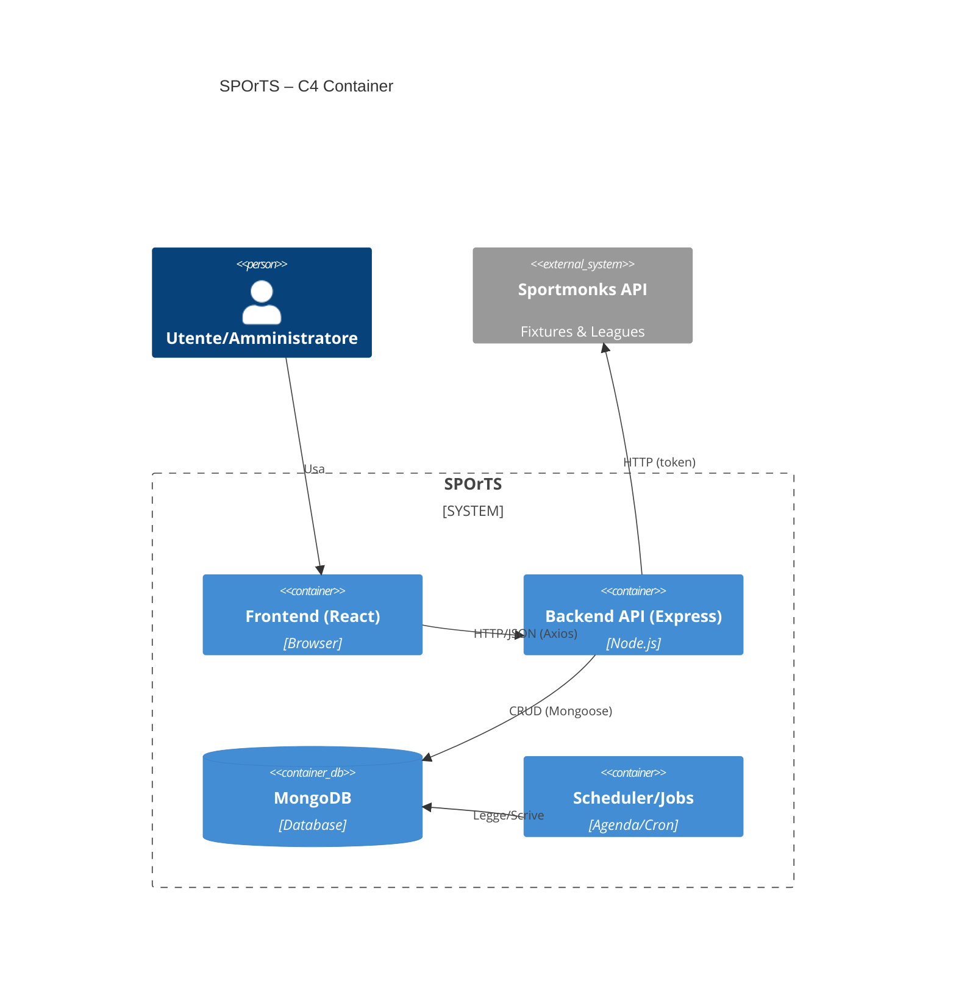
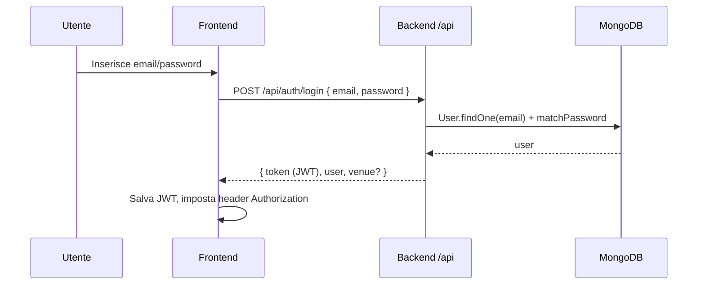
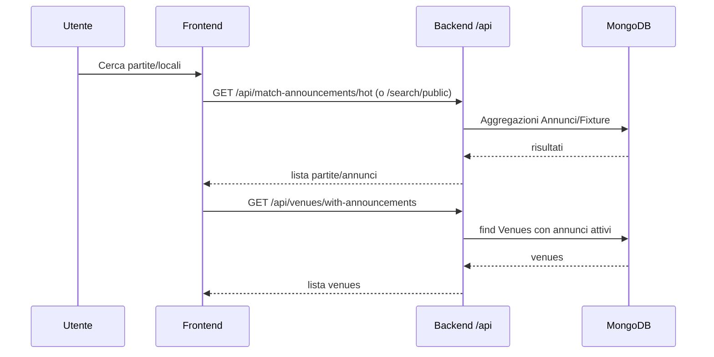
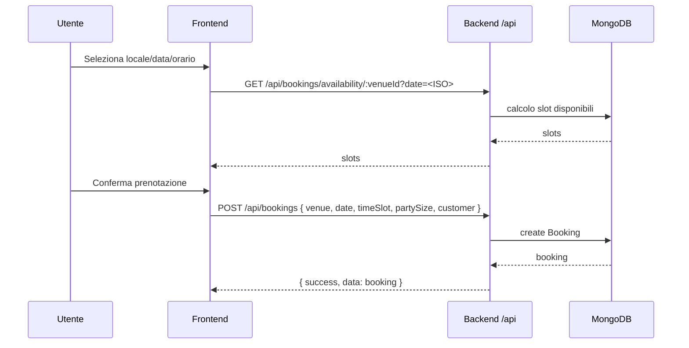
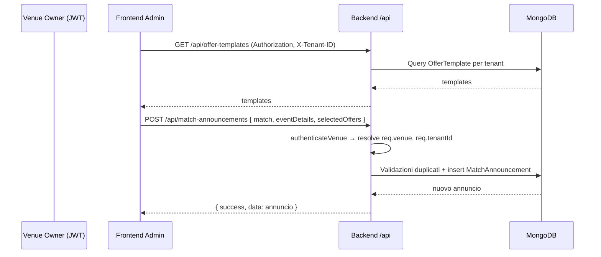

## Diagrammi Architettura (Mermaid)

### C4 – Container (High-level)

### Sequence – Login

### Sequence – Ricerca Locali

### Sequence – Prenotazione

### Sequence – CRUD Admin (Annuncio Partita)

