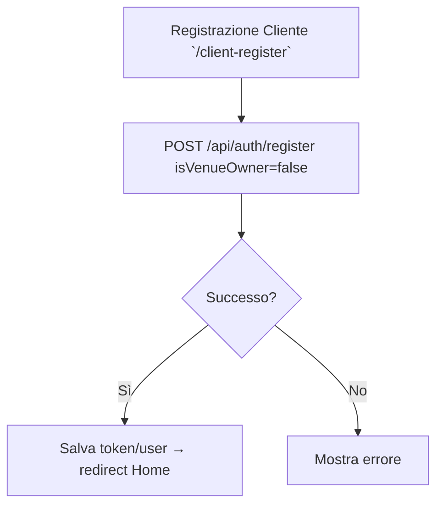
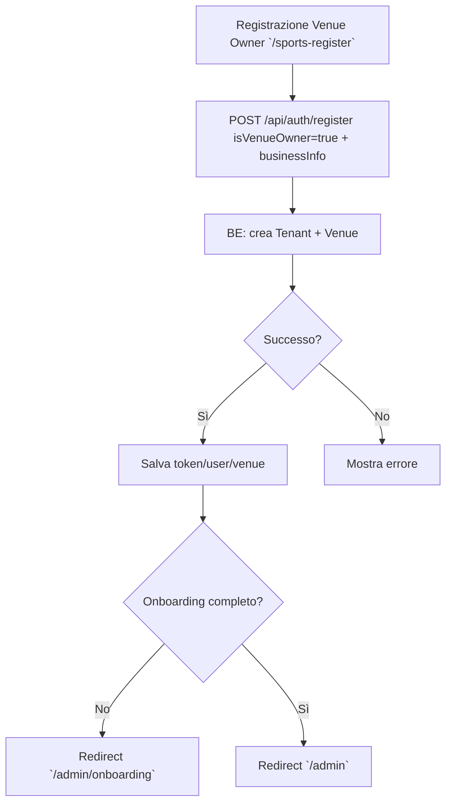
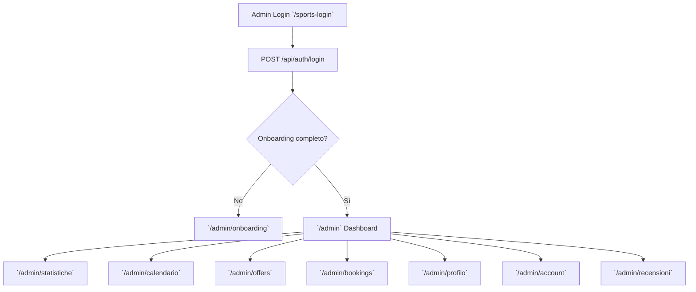

### Flowchart (Mermaid)

```mermaid
flowchart TD
  A[Guest su Home `/`] --> B{Serve login?}
  B -- No --> C[Visita `/locali`]
  C --> D[Dettaglio `/locale/:id`]
  D --> E[Compila form prenotazione]
  E --> F[POST /api/bookings]
  F --> G{Booking confermata?}
  G -- Sì --> H[Conferma UI + (Se loggato) link a `/my-bookings`]
  G -- No --> I[Errore/Conflict → mostra messaggio + retry]
  B -- Sì --> L[Vai a `/client-login`]
  L --> M[POST /api/auth/login]
  M --> N{Successo?}
  N -- Sì --> C
  N -- No --> O[Errore credenziali]
```







```mermaid
flowchart TD
  A[Dettaglio Venue `/locale/:id`]
  A --> B[Seleziona data/ora/persone]
  B --> C[POST /api/bookings]
  C --> D{Conflitti?}
  D -- No --> E[Status confirmed (se auto-approve) + code]
  E --> F[UI conferma → (opz.) `/my-bookings`]
  D -- Sì --> G[Mostra errore e suggerisci altro slot]
```


